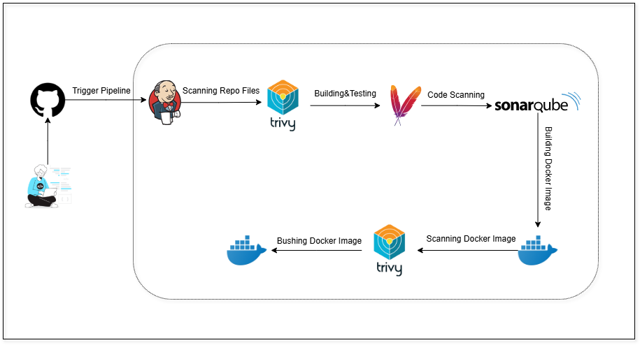
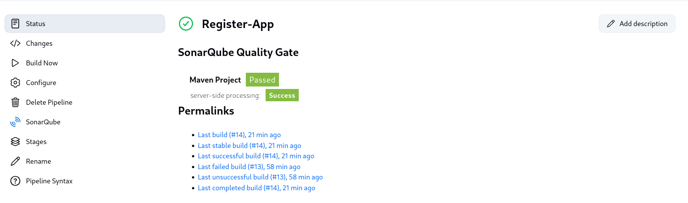
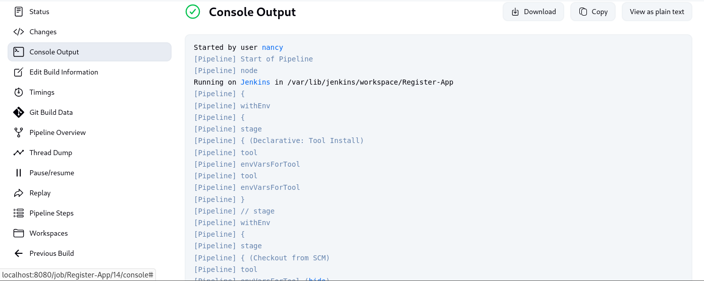
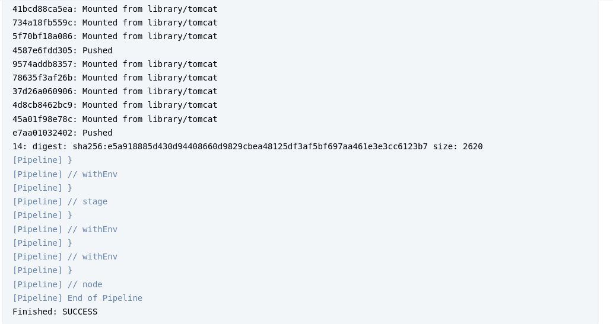

# 🚀 Register App — CI/CD Deployment Guide

Welcome to the Register App CI/CD deployment guide!  
This guide outlines a fully automated DevOps pipeline that handles building, scanning, analyzing, and pushing a Java-Maven application Docker image using Jenkins and other DevOps tools.


---

## 🧱 Technology Stack

| 🔧 Tool     | 💡 Role                                     |
|------------|----------------------------------------------|
| Jenkins    | Automates build and deployment               |
| Maven      | Builds the Java application                  |
| SonarQube  | Performs static code analysis                |
| Trivy      | Scans code and Docker images for vulnerabilities |
| Docker     | Builds and pushes container images           |
| GitHub     | Hosts the source code                        |

---

## ⚙️ CI/CD Pipeline Breakdown

### 1️⃣ Checkout from GitHub
- Jenkins pulls the source code from the GitHub repository’s `main` branch.

---

### 2️⃣ Trivy File System Scan
- Install Trivy on your Jenkins host:
```bash
sudo apt-get install wget gnupg
wget -qO - https://aquasecurity.github.io/trivy-repo/deb/public.key | \
  gpg --dearmor | sudo tee /usr/share/keyrings/trivy.gpg > /dev/null
echo "deb [signed-by=/usr/share/keyrings/trivy.gpg] https://aquasecurity.github.io/trivy-repo/deb generic main" | \
  sudo tee /etc/apt/sources.list.d/trivy.list
sudo apt-get update
sudo apt-get install trivy
```
- Scans the source code files for known vulnerabilities using Trivy.
- Report is saved in HTML format (e.g., `fs.html`).

---

### 3️⃣ Maven Build
- Compiles the Java application and generates a `.jar` file using Maven.
  
  

---

### 4️⃣ SonarQube Code Analysis
- To run a local instance of SonarQube using Docker, execute the following command:
```bash
docker run -d --name sonarqube -p 9000:9000 sonarqube:lts
```
 -This will run SonarQube in a container on http://localhost:9000.
- Jenkins runs a code quality scan using SonarQube.
- Analyzes bugs, vulnerabilities, and code smells.
- Requires a credential ID in Jenkins: `sonarqube-token`.


---

### 5️⃣ Docker Image Build
- Jenkins builds a Docker image from the application code.
- Image is tagged using the Jenkins build number.

---

### 6️⃣ Trivy Docker Image Scan
- Trivy scans the built Docker image for vulnerabilities.
- Report is generated and saved as `register-app-scan.html`.

---

### 7️⃣ Push to DockerHub
- Docker image is pushed to DockerHub using Jenkins credentials.
- Credential ID used: `dockerhub-token`.


---

## 🔐 Jenkins Credentials

| Credential ID       | Used For               |
|---------------------|------------------------|
| `sonarqube-token`   | SonarQube Authentication |
| `dockerhub-token`   | DockerHub Authentication |


---

### 🔧 Pipeline Build 





---


