# 🚀 Register App — CI/CD Deployment Guide

Welcome to the Register App CI/CD deployment guide!  
This project implements a complete CI/CD pipeline using Jenkins, integrating tools like Trivy, SonarQube, Docker, and ArgoCD to automate the build, test, security scanning, containerization, and deployment process of a Java-based application.


---

## 🧱 Technology Stack

| 🔧 Tool     | 💡 Role                                     |
|------------|----------------------------------------------|
| Jenkins    | Automates build and deployment               |
| Maven      | Builds the Java application                  |
| SonarQube  | Performs static code analysis                |
| Trivy      | Scans code and Docker images for vulnerabilities |
| Docker     | Builds and pushes container images           |
| GitHub     | Hosts the source code                        |
| Kubernetes | Orchestrates and runs containerized applications    |
| Helm       | Manages Kubernetes resources using Helm charts      |
| ArgoCD     | Automates deployment using GitOps for Kubernetes    |
| Prometheus | Monitors and collects application performance data  |
| Grafana    | Visualizes metrics and performance dashboards       |

---

## ⚙️ CI/CD Pipeline Breakdown

### 1️⃣ Checkout from GitHub
- Jenkins pulls the source code from the GitHub repository’s `main` branch.

---

### 2️⃣ Trivy File System Scan
- Install Trivy on your Jenkins host:
```bash
sudo apt-get install wget gnupg
wget -qO - https://aquasecurity.github.io/trivy-repo/deb/public.key | \
  gpg --dearmor | sudo tee /usr/share/keyrings/trivy.gpg > /dev/null
echo "deb [signed-by=/usr/share/keyrings/trivy.gpg] https://aquasecurity.github.io/trivy-repo/deb generic main" | \
  sudo tee /etc/apt/sources.list.d/trivy.list
sudo apt-get update
sudo apt-get install trivy
```
- Scans the source code files for known vulnerabilities using Trivy.
- Report is saved in HTML format (e.g., `fs.html`).

---

### 3️⃣ Maven Build
- Compiles the Java application and generates a `.jar` file using Maven.
  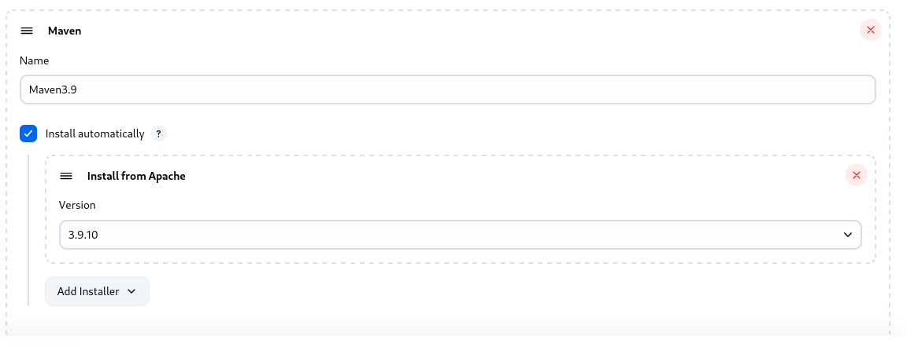
  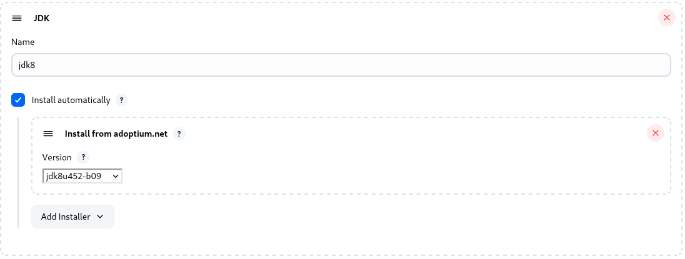

---

### 4️⃣ SonarQube Code Analysis
- To run a local instance of SonarQube using Docker, execute the following command:
```bash
docker run -d --name sonarqube -p 9000:9000 sonarqube:lts
```
 -This will run SonarQube in a container on http://localhost:9000.
- Jenkins runs a code quality scan using SonarQube.
- Analyzes bugs, vulnerabilities, and code smells.
- Requires a credential ID in Jenkins: `sonarqube-token`.
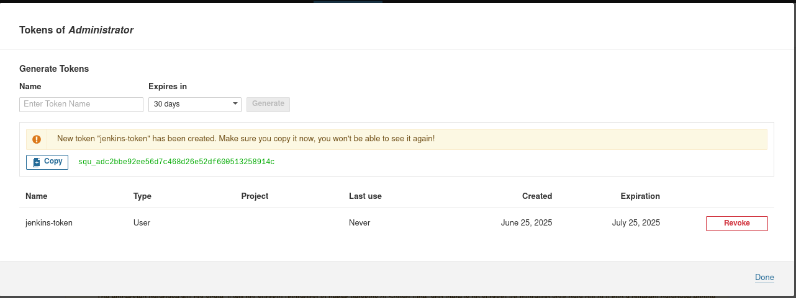
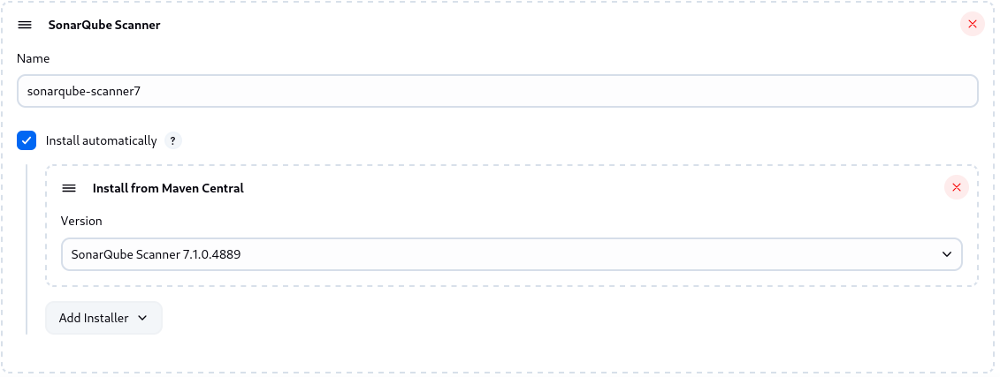
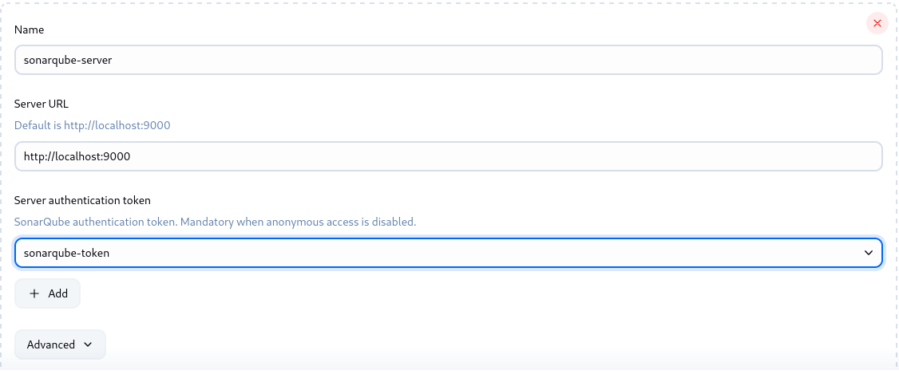
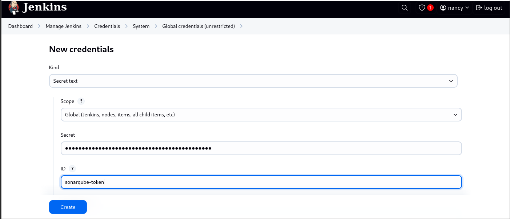

---

### 5️⃣ Docker Image Build
- Jenkins builds a Docker image from the application code.
- Image is tagged using the Jenkins build number.

---

### 6️⃣ Trivy Docker Image Scan
- Trivy scans the built Docker image for vulnerabilities.
- Report is generated and saved as `register-app-scan.html`.

---

### 7️⃣ Push to DockerHub
- Docker image is pushed to DockerHub using Jenkins credentials.
- Credential ID used: `dockerhub-token`.
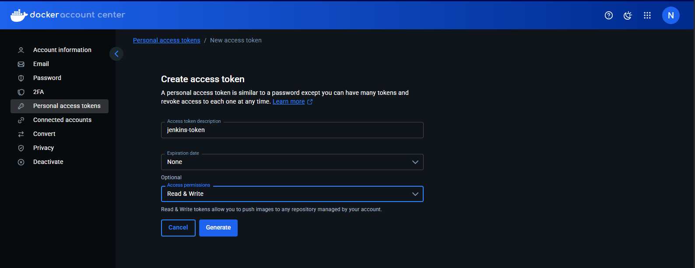

---

### 🧱 Install ArgoCD
```bash
kubectl create namespace argocd
kubectl apply -n argocd -f https://raw.githubusercontent.com/argoproj/argo-cd/stable/manifests/install.yaml
kubectl port-forward svc/argocd-server -n argocd 8000:443
```
🔐 Retrieve Admin Password
```bash
kubectl get secret argocd-initial-admin-secret -n argocd \
  -o jsonpath="{.data.password}" | base64 --decode
```
📥 Install ArgoCD CLI
```bash
VERSION=$(curl -s https://api.github.com/repos/argoproj/argo-cd/releases/latest \
  | grep tag_name | cut -d '"' -f 4)
curl -sSL -o argocd "https://github.com/argoproj/argo-cd/releases/download/$VERSION/argocd-linux-amd64"
chmod +x argocd
sudo mv argocd /usr/local/bin/
```
🔑 Login to ArgoCD
```bash
argocd login <ARGOCD_HOST> --username admin
```
🔧 Configure ArgoCD
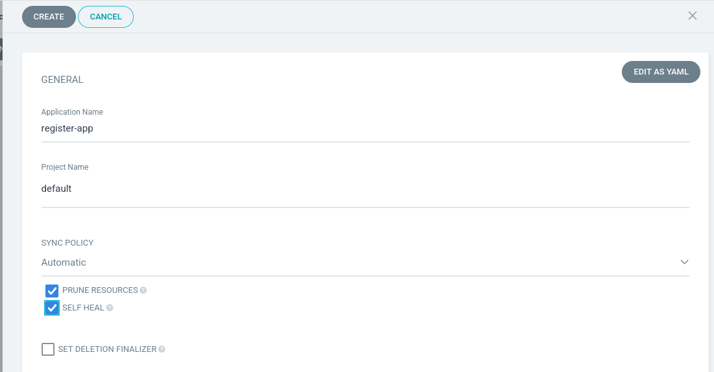
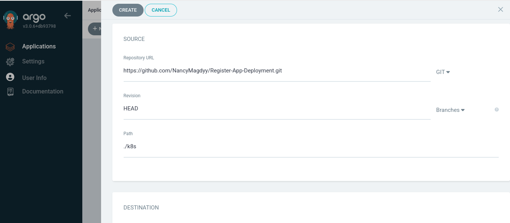
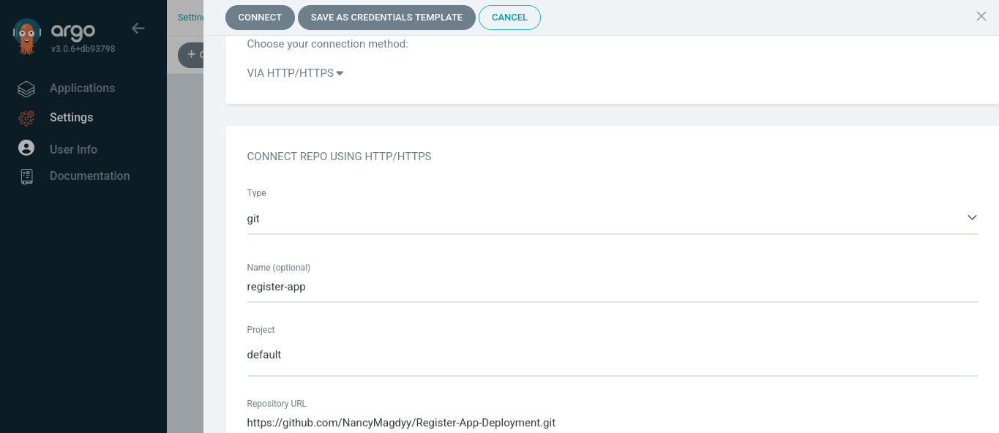
---

📊 Monitoring & Observability (Prometheus + Grafana)
To monitor your application and infrastructure, install Prometheus and Grafana using Helm.

🚀 Install Helm
```bash
curl https://raw.githubusercontent.com/helm/helm/master/scripts/get-helm-3 | bash
```
📦 Add Helm Repositories
```bash
helm repo add prometheus-community https://prometheus-community.github.io/helm-charts
helm repo add grafana https://grafana.github.io/helm-charts
helm repo update
```
📈 Deploy Prometheus & Grafana
```bash
kubectl create namespace monitoring
helm install prometheus prometheus-community/prometheus -n monitoring
helm install grafana grafana/grafana -n monitoring
```
🔌 Access Grafana Dashboard
```bash
kubectl port-forward -n monitoring svc/grafana 3000:80
```
🔐 Retrieve Grafana Admin Password
```bash
kubectl get secret -n monitoring grafana -o jsonpath="{.data.admin-password}" | base64 --decode
```
---
📊 Setup Grafana Dashboards
- Login to Grafana at http://localhost:3000
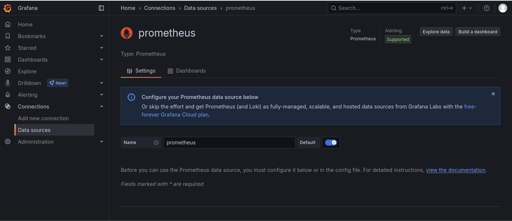
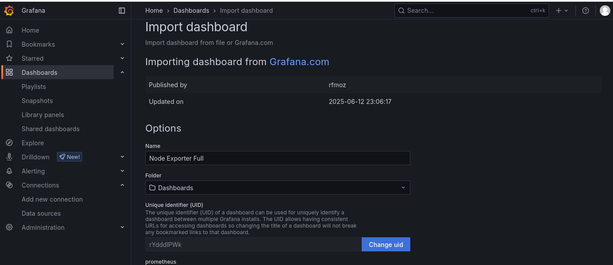

---

## 🔐 Jenkins Credentials

| Credential ID       | Used For               |
|---------------------|------------------------|
| `sonarqube-token`   | SonarQube Authentication |
| `dockerhub-token`   | DockerHub Authentication |

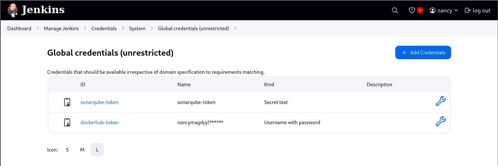


---
